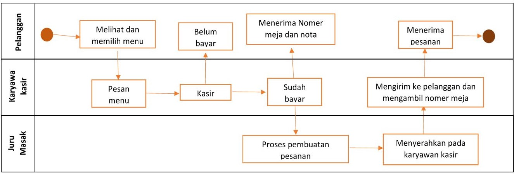
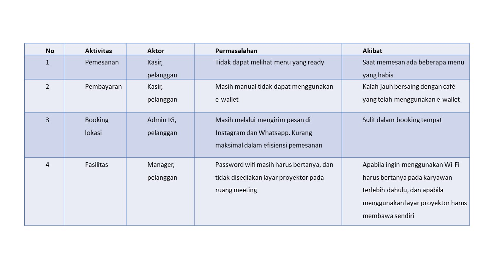

#Diagram AS-IS#

Pelanggan melihat dam memilih menu yang akan dipesan. Pelanggan menyampaikan pesanan kepada karyawan kasir. Kasir menjumlahkan harga yang harus di bayar pelanggan. Pelanggan membayar dan menerima nota dan nomer meja dari karyawan kasir. Juru masak menerima pesanan dan memproses pesanan. Selanjutnya memberikan kepada karyawan kasi. Karyawan kasir mengantarkan pesanan pada pelanggan. Pelanggan menerima pesanan dan karyawan kasir mengambil nomer meja ssebagai bukti pesanan telah diantar.

Sedangkan untuk permasalah-permasalahan yang saat ini timbul yaitu:
